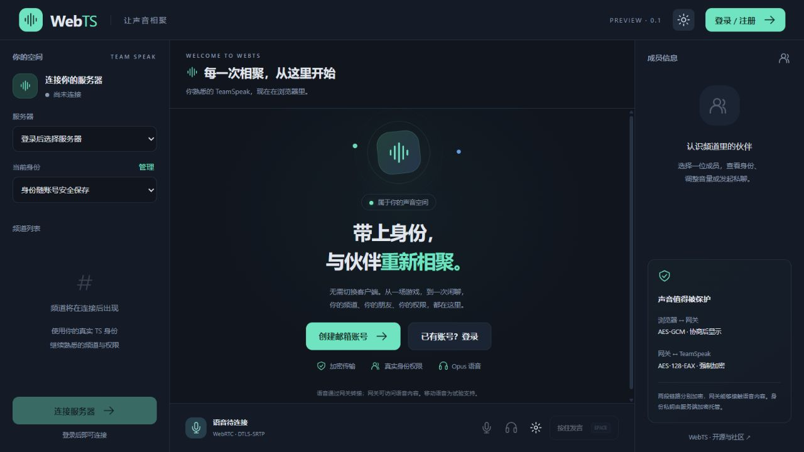

<div align="center">

# WebTS

**把你的 TeamSpeak，带进浏览器。**

自托管 · 真实身份 · 权限继承 · 加密语音

[](LICENSE)
[](https://github.com/PTPHAP/WebTS/actions/workflows/check.yml)

[部署指南](docs/DEPLOYMENT.md) · [身份互用](docs/IDENTITIES.md) · [语音与头像](docs/CLIENT.md) · [安全说明](docs/SECURITY.md) · [参与贡献](CONTRIBUTING.md)

</div>

---

WebTS 是面向 TeamSpeak 3 / 6 的开源网页客户端。用邮箱登录，管理自己的多个 TeamSpeak 身份，让社区成员通过浏览器加入已有服务器。

> **0.1 预览版**：已提供可启动的网页、账号与多身份接口、真实 TS 协议网关、WebRTC Opus 转发及部署配置。TS3 / TS6 原生客户端兼容及容量目标仍需完整验收；部署者也应验证自己的邮件与网络环境，请先在独立测试环境部署。

[下载完整预览源码包](https://github.com/PTPHAP/WebTS/releases) · [更新记录](CHANGELOG.md)。Release 中的 `webts-…-source.zip` 包含固定的协议子模块源码，可解压后构建 Docker；GitHub 自动生成的源码归档不包含子模块内容，需要按部署指南递归克隆。



## 为你的社区而设计

| 体验 | 0.1 提供 |
| --- | --- |
| 浏览器加入 | 中文界面、深浅主题，频道、聊天和成员同屏显示 |
| 一个账号，多个身份 | 邮箱注册与找回，导入、创建、命名、切换和导出身份 |
| 原有权限继续使用 | 以真实TS身份连接，权限由目标服务器决定 |
| 站点管理 | 管理员配置邮箱与默认服务器、控制自定义连接，保存后立即生效 |
| 断线恢复 | 持续退避重连、恢复断线前实际频道；支持手动停止，尊重权限与加密策略 |
| 清晰的语音控制 | Opus、静默自动停发、默认 V 自定义按键、本地 GTCRN / RNNoise、严格过滤默认关闭、AEC/AGC实际状态、设备与音量、耳语 |
| 服务器头像互通 | 设置本人TS服务器头像，显示可见成员头像，失败可重试 |
| 频道资料 | 常驻介绍、有限安全BBCode，单击查看、按钮或双击加入；密码由TS权限判定 |
| 手机操作 | 触控加入频道、常驻语音按钮、屏幕键盘适配；移动语音为试验支持 |
| 连接质量与提示音 | 两段链路RTT、接收统计；连接、频道动态、消息和戳一戳音效，可关闭或调音量 |
| 自己掌握数据 | 单进程Rust网关、SQLite、本地密钥，便于部署与备份 |

## 加密，讲清楚边界

身份私钥采用 **AES-256-GCM** 加密托管。网站运营者持有解密能力，账号密码重置不会改变TS身份。

浏览器至网关使用 HTTPS/WSS 与 WebRTC DTLS-SRTP；目标设计优先 AES-256-GCM，兼容下限 AES-128-GCM。网关至TeamSpeak使用原生协议加密，当前固定协议库为 **AES-128-EAX**。必须开启服务器全局语音加密，不能确认时拒绝语音。

这属于两段传输加密：网关能够接触语音内容。不会把它标成端到端加密或全链路AES-256。[了解安全边界 →](docs/SECURITY.md)

## 本地开发

```sh
git clone --recurse-submodules https://github.com/PTPHAP/WebTS.git
cd WebTS
sh scripts/prepare-vendor.sh
cd web && npm ci && npm run build && cd ..
cargo build --release --package web-ts --locked
mkdir -p secrets data
cargo run --release --locked -- init-key secrets/master.key
cp config.example.toml config.local.toml
# 填写 TS 服务器、SMTP；本地开发默认 localhost:8080
cargo run --release --locked -- serve config.local.toml
```

Windows开发、配置和协议探针见[部署指南](docs/DEPLOYMENT.md)。不要把身份文件、密钥、数据库或真实配置提交到仓库。

## 部署前准备

一个 HTTPS 域名、一台可访问目标 TS 的 Linux 主机、可通过 TLS 发信的 SMTP 账号，以及开启 **Globally on** 语音加密的 Opus 频道。受限网络可选配置带认证的 TURN。

提供 Docker Compose、Caddy HTTPS 配置、systemd 服务和 Linux 构建包。构建成功后，可在 [Actions](https://github.com/PTPHAP/WebTS/actions/workflows/check.yml) 下载带 SHA-256 校验的 Linux 包；完整步骤见[部署指南](docs/DEPLOYMENT.md)。

### 使用流程

邮箱注册 → 验证邮箱 → 创建或导入身份 → 选择服务器 → 连接。默认持续开麦，静音后停止发送，也可切换为空格按键发言；选择频道后点击“进入此频道”，桌面也支持双击切换，选择成员可私聊、戳一戳和调整音量。仅在TS明确要求频道密码后询问，有豁免权限可直接进入。

语音设置提供提示音开关、音量及连接质量。发言亮灯依据实际连续音频帧，区分麦克风开启与正在发言。网络RTT不等于说话到听见的总延迟；详见[语音说明](docs/CLIENT.md)。

验证与找回邮件提供按钮及备用链接；网页显示确认结果。验证链接过期后，可重新发送邮件，无需重新设置注册密码。

聊天和管理使用当前 TS 身份权限，网站账号不会额外授予管理员权限。通用文件传输、屏幕共享、组权限编辑和旧语音编码尚未提供；头像使用专用服务器文件传输。

## 项目与许可

React · TypeScript · Rust · Tokio · Axum · SQLite · Opus · WebRTC

MIT许可，见[LICENSE](LICENSE)。第三方许可保留各自声明，见[THIRD_PARTY_NOTICES.md](THIRD_PARTY_NOTICES.md)。WebTS是独立第三方客户端，与TeamSpeak官方无隶属关系。
